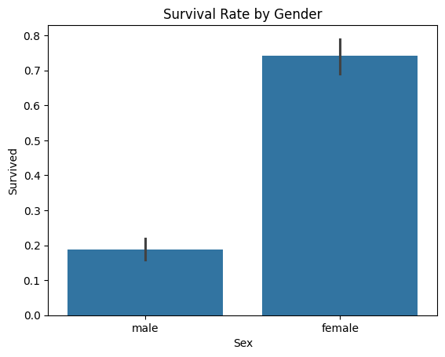
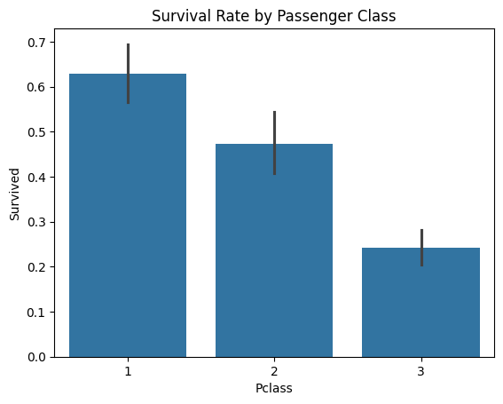
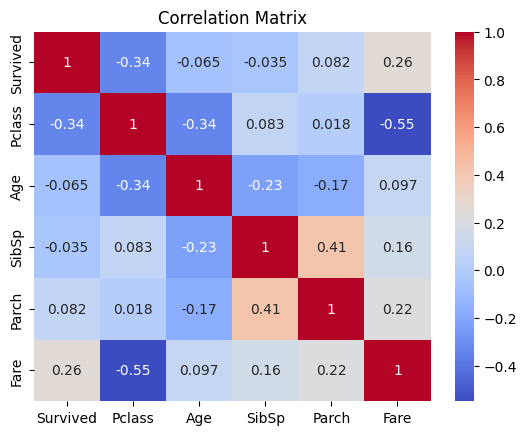

# Exploratory Data Analysis on Titanic Dataset

### Project Overview
This project performs an exploratory data analysis (EDA) on the classic Titanic dataset to uncover patterns and relationships that influenced passenger survival. The analysis covers data cleaning, statistical summaries, and data visualization.

### Key Findings
* **Survival by Gender**: Female passengers had a significantly higher survival rate than male passengers, a finding consistent with the "women and children first" protocol.
* **Survival by Passenger Class**: There was a clear relationship between passenger class and survival. Passengers in 1st class had a much higher survival rate than those in 3rd class.
* **Correlation between Fare and Survival**: Passengers who paid a higher fare had a greater likelihood of survival.

### Visualizations
The following visualizations illustrate the key findings from the analysis:

#### Survival Rate by Gender

#### Survival Rate by Passenger Class

#### Correlation Matrix

### Tools & Technologies
* Python
* Pandas
* Matplotlib
* Seaborn

### Data Source
The dataset used for this analysis is the [Titanic: Machine Learning from Disaster](https://www.kaggle.com/c/titanic) dataset from Kaggle.
